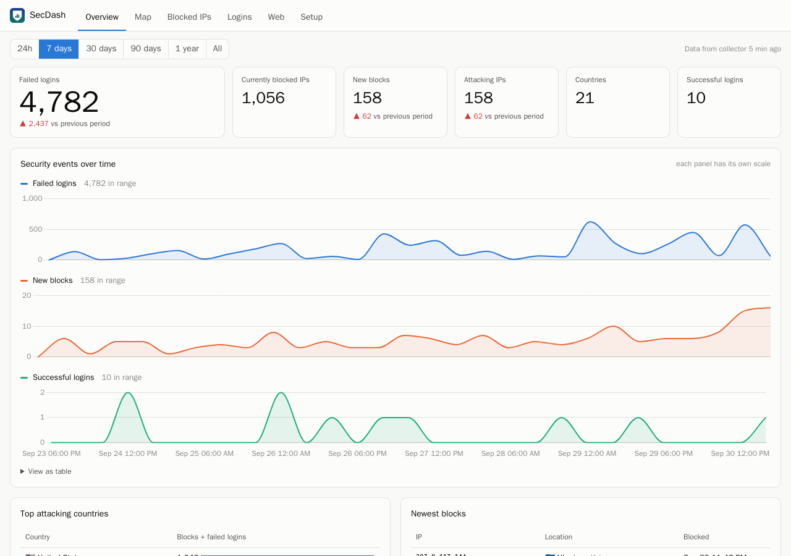
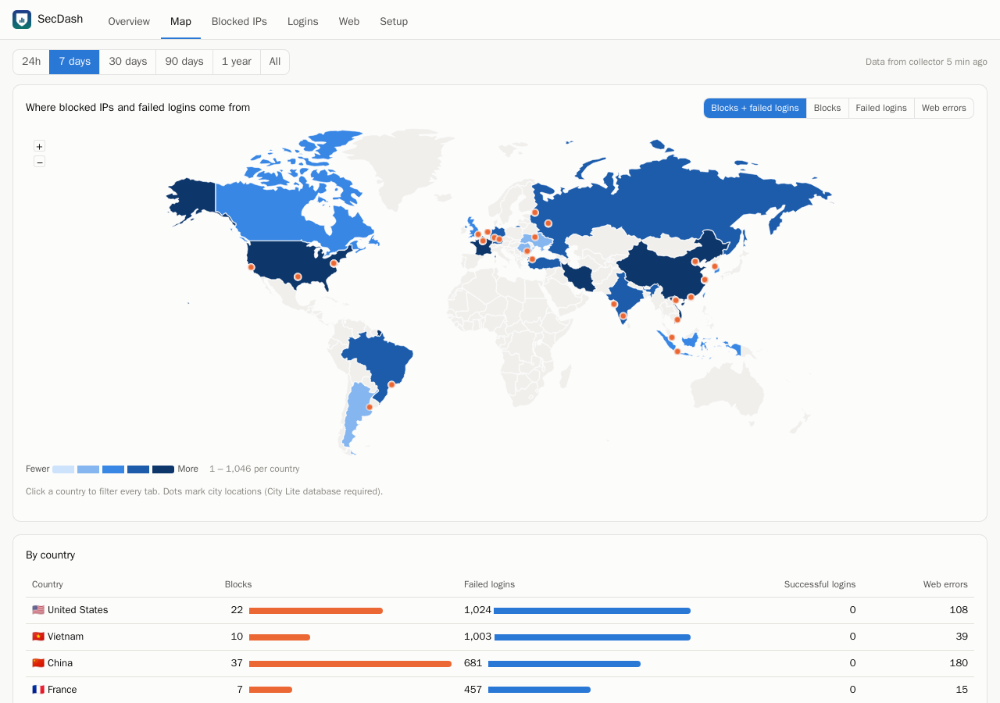
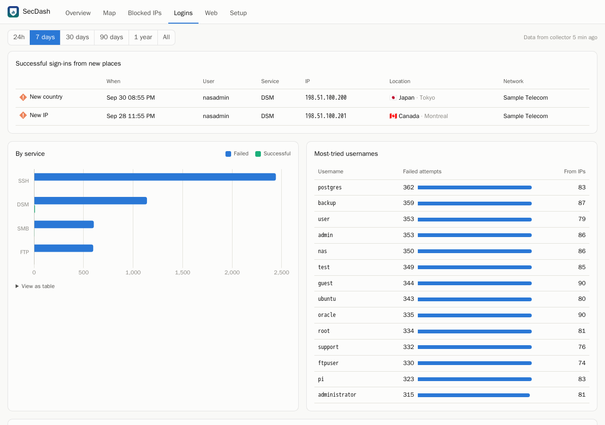
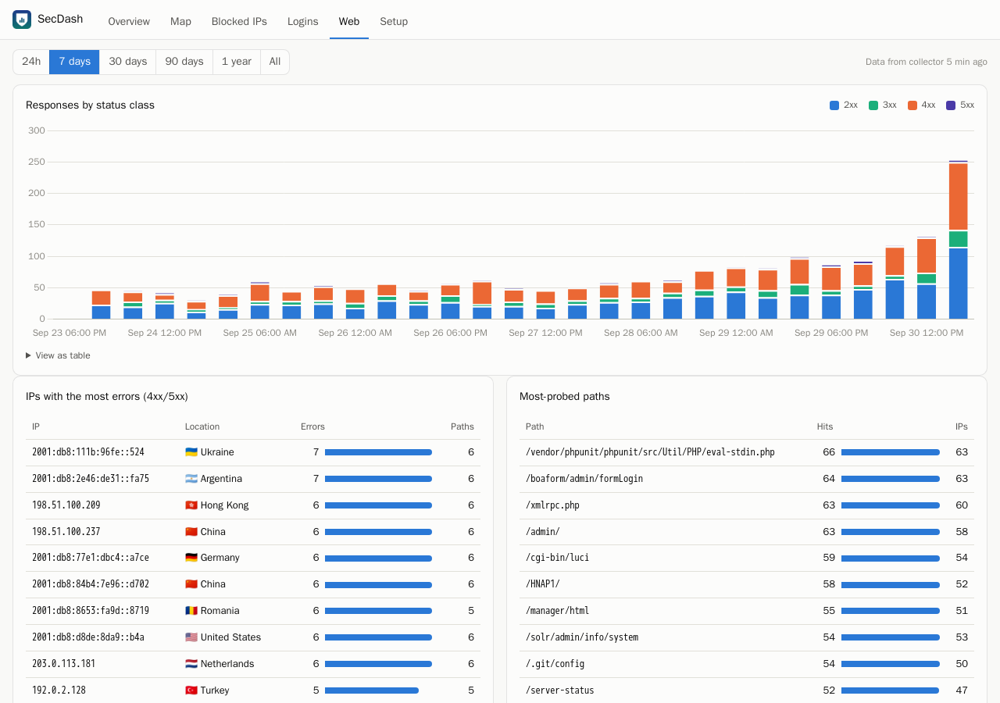
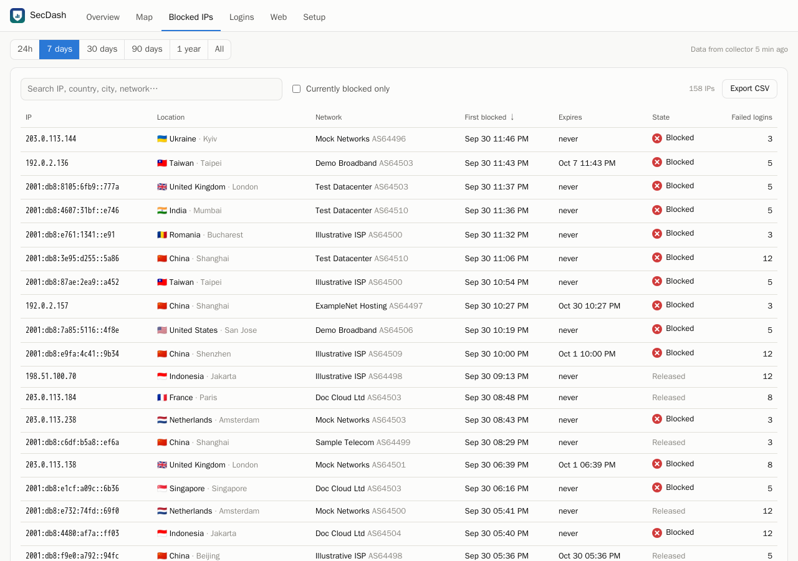

# SecDash for Synology DSM

A security analytics dashboard packaged as a `.spk` for Synology DSM 7. It shows:

- **Where blocked IPs come from** (world map, country, city and network) using DSM's Auto Block list
- **Failed and successful sign-ins** to DSM, SSH, SMB, FTP and more, with most-tried usernames and a day-by-hour heatmap
- **Successful sign-ins from a country or IP never seen before**
- **Reverse-proxy traffic**: which IPs trigger 4xx/5xx errors, which paths get probed (`/wp-login.php`, `/.env`, …), and the user agents behind them
- **Full history for any single IP** across every source, with its WHOIS record and a ready-to-send abuse report to the network's owner



| Map | Logins |
|---|---|
|  |  |
| **Web (reverse proxy)** | **Blocked IPs** |
|  |  |

> Screenshots use generated demo data with documentation-only IP ranges.

## How it works

```
Task Scheduler (root, every 5 min)            SecDash package (runs as sc-secdash)
  collector script ── copies ──▶ var/inbox/ ──▶ daemon: parse, dedupe, GeoIP ──▶ SQLite
                                                                                │
  DSM desktop ── SecDash app (DSM login, administrators only) ── api.cgi ───────┘
```

DSM 7 doesn't let third-party packages run as root, but DSM's security logs can only be read by root. SecDash splits the work in two:

- **The collector** is a short shell script that you paste into Task Scheduler as a root task. It **only copies** these files:
  - `/etc/synoautoblock.db`
  - the Log Center connection log
  - only the "Host [ip] was blocked via [service]" lines from the Log Center system log
  - sshd/ftpd and DSM sign-in failure lines from syslog
  - reverse-proxy access logs

  The copies are unpacked **as the unprivileged package user**, so root never writes into a folder the package controls. The script is stored in Task Scheduler, not in the package, so the package can't change what runs as root.
- **The package** runs unprivileged. A small Python daemon (stdlib only, using DSM's built-in Python 3.8) parses each batch, skips entries it has already stored, and looks up where each IP is. Everything stays on the NAS.
- **The dashboard** opens from the DSM main menu in a normal DSM window you can resize, minimise and maximise. Every API call is checked against your DSM session, and only members of `administrators` can see data.

## Install

1. Download the latest `SecDash-x.y.z-noarch.spk` from [Releases](https://github.com/jasonc123456/syno-secdash/releases).
2. In DSM, go to **Package Center › Manual Install** and choose the `.spk`. DSM warns that the package comes from an unknown publisher, because it isn't signed by Synology. That's expected.
3. Open **SecDash** from the main menu and go to the **Setup** tab.
4. Create the collector task:
   - Go to **Control Panel › Task Scheduler › Create › Scheduled Task › User-defined script**.
   - **General:** name it `SecDash collector` and set the user to **root**.
   - **Schedule:** daily, repeat **every 5 minutes**.
   - **Task Settings:** paste the script shown on the Setup tab. It's the same as [`package/bin/collector.sh`](package/bin/collector.sh).
   - Save, then click **Run** once.

Data shows up within a minute. On the first run, the IP lookup database is upgraded from Country Lite (bundled) to City and ASN Lite, which the NAS downloads itself.

### Compatibility

| | |
|---|---|
| **Tested on** | DSM 7.3.2 and 7.4.1 on an **x86_64** (Intel/AMD) NAS |
| **Should also work on** | DSM 7.2+ on ARM models. The package is `noarch` (Python and shell only, nothing compiled), but this hasn't been tested yet. Reports welcome. |
| **Needs** | `python3`, which is built into DSM 7 |
| **Not supported** | DSM 6.x. Its package format and desktop integration are different. |

### Reverse-proxy logs

The **Web** tab reads nginx access logs in the standard `combined` format. By default the collector looks for `/var/log/nginx/*access*.log`. On many DSM builds, the built-in reverse proxy doesn't write access logs at all. If yours does, or if you run another proxy that writes `combined` logs, add the paths to `NGINX_LOGS` at the top of the collector script:

```sh
NGINX_LOGS="/var/log/nginx/*access*.log /volume1/docker/proxy/logs/*access*.log"
```

### What is stored

Everything lives in `/var/packages/SecDash/var/secdash.db` on the NAS and is kept for 365 days by default. You can change that, or delete older records straight away, under **Setup › Data retention**. SecDash makes two kinds of outbound request:

- the monthly download of the DB-IP database from `download.db-ip.com`
- a WHOIS (RDAP) lookup when you expand **WHOIS** or **Report abuse** for an IP. This sends that IP to the regional internet registry that holds it: ARIN, RIPE NCC, APNIC, LACNIC or AFRINIC.

**Report abuse** opens a draft in your own email app. Nothing is emailed from the NAS, and the usernames that were tried aren't included.

Uninstalling the package deletes the data. The collector task then does nothing, and you can delete it.

## Checking your DSM's log formats

DSM builds differ slightly in where they keep logs and how they format them. If a tab stays empty, run the read-only probe over SSH and open an issue with its output:

```sh
sudo sh discover.sh    # from tools/discover.sh
```

It prints table layouts and a few sample lines. IP addresses are masked and usernames replaced before anything is printed or saved.

## Build from source

```sh
./build.sh                       # → dist/SecDash-<version>-noarch.spk
python3 -m unittest discover -s tests -t .
```

`build.sh` needs only `sh`, `tar`, `gzip` and `python3`. It downloads DB-IP Country Lite on the first build.

### Local development

```sh
python3 dev/seed.py              # synthetic year of data → dev/demo.db
python3 dev/serve.py             # http://127.0.0.1:8765/
```

The dev server serves the real UI and API, with the DSM login check skipped.

### Layout

| Path | What it is |
|---|---|
| `package/bin/secdashd.py` | daemon: ingest, GeoIP, retention, monthly DB update |
| `package/bin/collector.sh` | root collector (copied into Task Scheduler by the user) |
| `package/lib/ingest_*.py` | parsers for Auto Block, connection and system log, syslog, nginx |
| `package/lib/api.py` | query API used by `api.cgi` |
| `package/lib/rdap.py` | WHOIS lookups over RDAP, using IANA's registry list (`rdap_bootstrap.json`) |
| `package/ui/` | the DSM app: `SecDash.js` + `config` (native DSM window), `index.html`/`dashboard.js` (the page inside it), `api.cgi` (DSM auth check) |
| `scripts/`, `conf/`, `INFO.in` | DSM package metadata and lifecycle scripts |

Releases are built by GitHub Actions. Pushing a `v*` tag attaches the `.spk` to a GitHub Release.

## License

MIT. See [LICENSE](LICENSE). Bundled components and their licenses are listed in [THIRD_PARTY_NOTICES.md](THIRD_PARTY_NOTICES.md).

IP geolocation by [DB-IP](https://db-ip.com), licensed under [CC BY 4.0](https://creativecommons.org/licenses/by/4.0/).

Synology and DSM are trademarks of Synology Inc. This project is not affiliated with or endorsed by Synology Inc.
